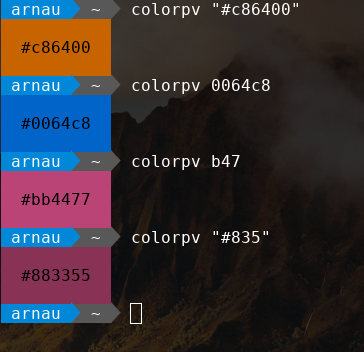

# ColorPV
A command line color previewing tool

## Installation
To install the tool, type the following commands on a terminal:
```
git clone https://github.com/Arnau478/colorpv.git
cd colorpv
chmod +x ./colorpv.sh
./colorpv.sh
```

To ensure it's installed type this command (which should show a quick help page):
```
colorpv -h
```

## Use
To preview a color, type it's hexadecimal value:
```
colorpv 00c864
```

## Examples
You can type colors in four different formats:

```
colorpv "#c86400"
```
```
colorpv 0064c8
```
```
colorpv b47
```
```
colorpv "#835"
```

## Screenshots

